<h1 align="center">Hey, I'm Gustavo Viana 👋</h1>

  Software Engineer · Security Researcher · AI Security

  

###

  
  
  
  
  
  
  
  
  
  
  
  
  
  
  
  
  

###

  
  
  
  
  
  

###

 

**Software Engineer** focused on the intersection of development and security. I build tools that solve real problems — from phishing detection to government infrastructure assessments.

Independent researcher with publications on Zenodo covering **AI Security** and **Web Security**. Currently focused on LLM security, DevSecOps, and resilient systems.

 

**Areas of interest:** Cybersecurity · AI Security · LLM Security · OSINT · Ethical Hacking · DevSecOps · Pentest

 

---

### 📄 Recent Publications

- **[ASR Does Not Measure What You Think It Measures](https://zenodo.org/records/20245521)** — Zenodo, May 2026
- **[Secure Prompt Engineering Framework (SPEF)](https://zenodo.org/records/20213674)** — Zenodo, 2026
- **[Brazilian Municipal Web Portals Security Assessment](https://zenodo.org/records/17536561)** — Zenodo, 2025

---

  

